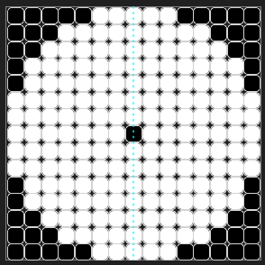
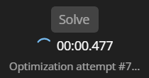

# APS Optimizer tool for From The Depths

This tool provides a simple, user-friendly method to easily generate density-optimized APS layouts for From The Depths.

---

## Features

- Support for 3, 4, and 5-clip tetris.
- Automatic turret layout templates, with the option to customize them for armour or extra space.
- Hard and soft symmetry enforcement options, including both rotational and reflexive symmetry.
- Export generated layouts directly to _From The Depths_ prefab file (`.blueprint`) for immidiate use in-game.
- Choose the resulting prefab height, mapped automatically to the respective blocks (loader/clip length variants).

---

## Requirements

- **cryptominisat5:** The advanced SAT solver used by this tool.
  - You need to download the `cryptominisat5` exe separately from its official source [here](https://github.com/msoos/cryptominisat/releases). Ensure the executable (`cryptominisat5.exe` on Windows) is available in your system's PATH or placed in the same directory as this tool.
- **.NET 8.0 Desktop Runtime:**
  - Currently required due to complications with WinUI for self-contained apps that I haven't figured out yet.
  - Trying to start the application should prompt you to download the runtime automatically, but if that doesn't happen you can get it [here](https://builds.dotnet.microsoft.com/dotnet/WindowsDesktop/8.0.15/windowsdesktop-runtime-8.0.15-win-x64.exe).

---

## Installation

1. Download APS_Optimizer.zip from the [latest release](https://github.com/trk20/APS-Optimizer/releases).
2. Extract to wherever you want to keep the app.
3. Download `cryptominisat5.exe` from their [latest release](https://github.com/msoos/cryptominisat/releases)
4. Either try to run the app (which should prompt for the desktop runtime) or install it from [here](https://builds.dotnet.microsoft.com/dotnet/WindowsDesktop/8.0.15/windowsdesktop-runtime-8.0.15-win-x64.exe)
5. When Windows gives a "Windows protected your PC" the first time, click on "Run anyway"

---

# Usage

### Solver Parameters

#### Grid Editor (1)

Allows for toggling of individual cells between blocked and clear for fully custom templates.

#### Symmetry Selector (2)

Tells the solver to enforce the selected symmetry.

Chosen symmetry will be displayed on editor and result displays.

**Rotational (90/180 degrees)**
 

**Reflexive (Vertical/Horizontal/Quadrants)**
 

#### Soft vs Hard Symmetry (3)

Tells the solver whether or not to discard non-symmetric placements where the rotated or reflected shape would intersect itself.

| **Soft Symmetry**                         | **Hard Symmetry**                   |
| ----------------------------------------- | ----------------------------------- |
|  |  |

#### Template Preset Selector (4)

Automatically applies the selected template pattern on selection and resize.

| **Circle (Center Hole)**                      | **Circle (No Hole)**                  | **None**                        |
| --------------------------------------------- | ------------------------------------- | ------------------------------- |
|  |  |  |

#### Grid Dimensions (5)

Changes the width and height of the grids.

**Note:**

- Larger sizes will take longer to solve, especially above 21x21 for 4-clip.

#### Shape Selection (6)

Indicates which shape(s) the solver is allowed to use to generate a solution.

**Notes:**

- The cooler in 5-clip allows self-intersection to ensure optimal solutions.
- Mixing clip types is pretty much never optimal in FTD, so enable multiple at your own digression.

## Solving

While the solver is finding a solution, you'll be presented with an updating display of how long it's taking and the current iteration attempt number.

**Note:**

- Iterations in this case mean that the solver is allowing progressively less dense solutions. This will happen a fair number of times in certain situations, especially with hard reflexive symmetry, 4-clip, and 5-clip.

Q: Why can't there be a progress bar?
A: The time taken is _very_ unpredictable - a single solver setting can be the difference between 0.2s and 40s. If you figure out how to accurately estimate how long it will take, please consider making an issue with the exact details or submit a pull request.

## Exporting to FTD

When a solution is ready, you'll be able to use the export menu by pressing the Export Result button directly under the result display.

This will give you a pop-up menu displaying the number of each shape placed, the total material cost, and the block count for the generated prefab. You can select the result height using the target height (between 1 and 8 for 3-clip and 4-clip).
Pressing "Save" will allow you to navigate and save the prefab to your From The Depths prefab folder or a subfolder to allow placement in-game - located at `...\From The Depths\Player Profiles\{username}\PrefabsVersion2\`.

Now you can open it up in-game!

Voila!

**Note:**

- If From The Depths was already open, you might have to refresh the prefabs folder.

---

## Tips and extra info

- Enforcing symmetry will usually reduce the compute time, at the risk of missing better asymmetric solutions.
- 3-clip solutions are almost always faster to solve than 4-clip and 5-clip.
- Hard reflexive symmetry (Horizontal or Vertical) is recommended for 5-clip - the solution is almost always still optimal, it usually solves quite a bit faster, and the result looks nice :\)
- If you need more space for coolers/recoil absorbers/rail chargers, but don't care where, try using the different symmetries.
- If you want to leave room at the front of the turret for armour, or want a specific shape of center hole, just use the editor grid to toggle the cells before solving.
- 3-clip almost always finds optimal solutions with rotational symmetry, and at larger sizes reflexive symmetry is often still optimal.

---

## Contributing

Contributions are welcome! If you'd like to help improve this tool, please feel free to:

- **Report Issues:** If you find a bug _or_ you have a suggestion, please open an issue using the [GitHub Issues tab](https://github.com/trk20/APS-Optimizer/issues). Provide as much detail as possible, including steps to reproduce the bug if applicable.
- **Submit Pull Requests:** If you've fixed a bug or added a feature:
  1.  Fork the repository.
  2.  Create a new branch for your changes.
  3.  Make your changes and commit them.
  4.  Push to your branch.
  5.  Open a Pull Request against the main branch of this repository. Please provide a clear description of your changes.
  6.  Request a review.

Note: for making and testing changes to the codebase, you'll need to be able to run and debug Uno Platform apps - refer to their documentation [here](https://platform.uno/docs/articles/get-started.html) for setting that up.

## Acknowledgements

- Thanks to the developers of `cryptominisat5` for their powerful SAT solver
- Thanks to **sascha** on stackoverflow for their fantastic [answer on a polynomio grid-packing question](https://stackoverflow.com/a/47934736) that served as the basis for this tool's core logic.
